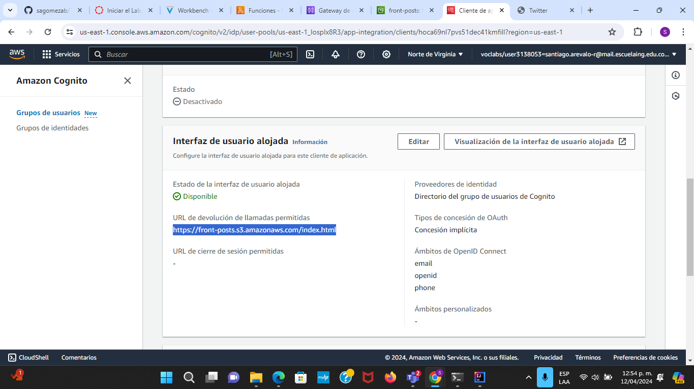

# TALLER 8: TAREA DE MICROSERVICIOS

## AUTHORS

- Santiago Arévalo Rojas [SANTIAROJAS18](https://github.com/santiarojas18)
- Daniel Santiago Gómez Zabala [SAGOMEZAB](https://github.com/sagomezab)
- Juan Felipe Sánchez Pérez [JUANSANXZ](https://github.com/juansanxz)

Este laboratorio consiste en diseñar y desarrollar un sistema tipo Twitter, donde los usuarios pueden realizar publicaciones de hasta 140 carácteres y estas se registran en un stream único de posts.

El proyecto también implica el despliegue de los archivos estaticos en AWS S3 para que esté disponible en internet, y luego se agrega seguridad utilizando JWT con el servicio Cognito de AWS. Posteriormente, se divide el monolito en tres microservicios independientes utilizando AWS Lambda, y se despliegan allí. Además, se implementa un servicio API Gateway de AWS para exponer lo servicios alojados en Lambda.

El repositorio en GitHub incluye todo el código desarrollado, así como informes detallados sobre la arquitectura utilizada, las pruebas realizadas y un video que demuestra el funcionamiento y la configuración adecuada del experimento.


## GETTING STARTED

1. **Maven**: Debe estar instalado en su computadora para ejecutar los comandos proporcionados.
2. **GitHub**: Necesitará una cuenta de GitHub para acceder al repositorio donde se encuentra el código del laboratorio.
3. **Ambiente de Java**: Debe tener un entorno de Java configurado para visualizar y ejecutar el código.
4. **AWS**: Se necesita acceso a la plataforma de computación en la nube de AWS para desplegar los servicios y microservicios desarrollados.

## INSTALLING

Para utilizar la aplicación, debe clonar el repositorio con el siguiente comando:

```
https://github.com/sagomezab/Taller8_AREP.git
```

Este paso le permitirá visualizar el código y ejecutar cada tarea según sea necesario.

## DEPLOYMENT

En primer lugar se crearon las funciones Lambda, en las que se cargó el código fuente y se mapearon los métodos correspondientes para atender el servicio. A continuación se evidencia la creación de las funciones:


Se procedio con la creación del API Gateway, configuran los métodos que originarian los endpoints para consumir el servicio de las funciones Lambda. A continuación se evidencia la creación de los endpoints:


Una vez se desplegó el API, se crea la siguiente URL para acceder a este:


La URL del API se va a consumir por el cliente asincrónico. A continuación se muestra la implementación:


Posteriormente se crea un bucket de S3 para alojar los archivos estáticos de la apliación:


A través de la siguiente URL se puede acceder a los archivos estáticos previamente cargados:


Ahora, se crea un pool de usuarios a través de cognito AWS para indicar quienes estan autorizados para consumir el servicio:


Se configuró la interfaz de usuario alojada dentro de cognito para que redirigiera a la URL generada por el bucket de S3, para acceder al servicio:



Finalmente probamos el funcionamiento de la arquitectura creada con ayuda de AWS.

Para ello ingresamos a la visualización de la interfaz de usuario alojada desde el browser y se visualiza lo siguiente:


Una vez accedemos al servicio con usuario autenticado, observaremos la aplicación:


Se crea un post con el contenido "Segunda prueba" y se comprueba el correcto funcionamiento:


### VIDEO
* [Video Probatorio](img/VideoLAB8.mp4)

## BUILT WITH

* [Maven](https://maven.apache.org/) - Administrador de dependencias


